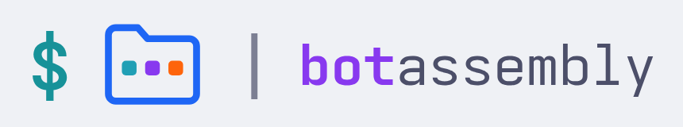

  <picture>
    <source media="(prefers-color-scheme: dark)" srcset="../images/botassembly-lockup-dark.png">
    
  </picture>

Open-source tools for running language models from the shell. MIT licensed.

- **[botassembly](https://github.com/botassembly/botassembly)**: a folder of Markdown files runs as an agent workflow, and every run leaves a record on disk. Docs at [botassembly.org](https://botassembly.org).
